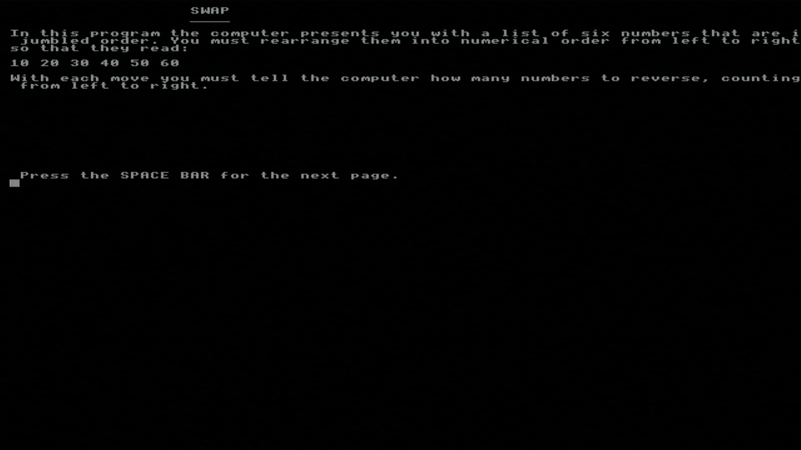

# Agon-Swap
Simple text puzzle game from BBC Micro adjusted for Agon Light (TM)

#### How to install and run:  
* Download the two files "SWAP.BBC" and "SWAP2.BBC" 
* Copy both files to SD card, insert in Agon Light, powerup.  
* In BBC Basic, type:

        CHAIN "SWAP"

#### How it was made:  
* Original source https://www.bbcmicro.co.uk/explore.php?id=3379 - "explore disk"
* Grab file "SWAP" and save as "SWAP2", as well as  file "25" and save as "SWAP", note that downloading didn´t work, copy n pasted from the "basic" view 
* Open each file in http://www.bbcbasic.co.uk/bbcsdl/index.html (note you have to select "any file" because they are *.bin)
* Change mode to 0, delete  occurences of "*FX15" (in line 140), change the CHAIN command to "SWAP2" (line 260)#
* Clean up the text/linebreaks
* Save each file as "*.BBC", in one of them I had to select "tokenized"

#### Screenshot:
 

https://www.youtube.com/watch?v=HMaCa89KopY

(CHAIN rather than LOAD+RUN tip thanks to my YouTube subscriber Richard Hallas https://www.youtube.com/channel/UCHW5dD5QYDTtOOmGdIOPRoA)
